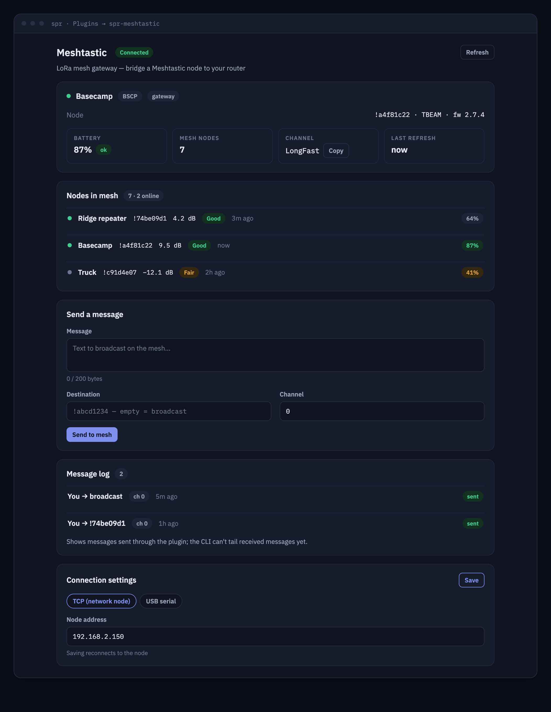

# spr-meshtastic



A [Meshtastic](https://meshtastic.org) LoRa mesh gateway plugin for
[SPR](https://github.com/spr-networks/super) (Secure Programmable Router).
It bridges a Meshtastic node to the router: see who's on the mesh, watch
battery/SNR, and send text messages — all from the SPR UI.

## About

The plugin runs a small container with the official
[Meshtastic Python CLI](https://github.com/meshtastic/python) and a Go backend
that drives it. The backend listens on a unix socket
(`/state/plugins/spr-meshtastic/socket.sock`); SPR proxies
`/plugins/spr-meshtastic/...` to it and embeds the bundled React UI as an
iframe under the Plugins menu. Nothing is exposed on the network.

Two ways to reach a node:

- **Network (TCP, default)** — a Meshtastic node with WiFi/Ethernet on your
  LAN (e.g. an ESP32 board), reached on TCP port 4403. No extra capabilities
  or devices needed.
- **USB serial (opt-in)** — a node plugged into the router's USB port,
  passed through to the container. See [Serial mode](#serial-usb-mode) below.

## Features

- Status card: node name, hardware, firmware, battery, mesh size, connection
- Nodes table: long/short name, node id, SNR, last heard, battery
- Send text messages: broadcast or direct (`!nodeid` / node number), channel 0-7
- Rolling message log (persisted in the plugin state dir)
- Primary channel URL display (share/QR link of the mesh channel)
- Strictly validated connection settings (RFC1918 IP or `/dev/tty...` device)
- Contributes the LoRa mesh (gateway + peers) to SPR's topology view

## UI install

1. In the SPR UI go to **Plugins → + New Plugin** and add
   `https://github.com/spr-networks/spr-meshtastic`.
2. Open **spr-meshtastic** at the bottom of the left-hand menu.
3. Assign the Meshtastic node to the `meshstatic` device group.
4. Under *Connection settings* pick **Network (TCP)** and enter the LAN IP of
   your Meshtastic node (enable WiFi + "TCP" / network API on the node with
   the Meshtastic app first), then **Save settings**.

## CLI install

```bash
cd /home/spr/super/plugins/
git clone https://github.com/spr-networks/spr-meshtastic
cd spr-meshtastic
./install.sh   # prompts for SUPERDIR, an SPR API token, and the node IP
```

## Serial (USB) mode

Serial passthrough is an explicit opt-in compose edit (the plugin ships with
no device access):

1. Edit `docker-compose.yml` and uncomment:

   ```yaml
   devices:
     - /dev/ttyUSB0:/dev/ttyUSB0
   group_add:
     - dialout
   ```

   Adjust `/dev/ttyUSB0` if your node enumerates differently (e.g.
   `/dev/ttyACM0`).
2. Rebuild/restart the plugin (`./build_docker_compose.sh && docker compose up -d`,
   or reinstall from the UI).
3. In the plugin settings choose **USB serial** and enter the same device path.

## API

All endpoints are served over the plugin unix socket and reachable through the
SPR API at `/plugins/spr-meshtastic/<path>` with a valid SPR session/token.

| Method | Path        | Description |
|--------|-------------|-------------|
| GET    | `/status`   | Connection state + node info (owner, id, hardware, firmware, battery, mesh size, channel URL). `?refresh=1` bypasses the 15s cache. |
| GET    | `/nodes`    | Nodes in the mesh: id, num, names, hwModel, SNR, lastHeard (unix ts), hopsAway, battery, voltage. `?refresh=1` to force. |
| POST   | `/message`  | `{"Text": "...", "To": "!abcd1234"?, "Channel": 0-7?}` — sends via `meshtastic --sendtext`. Empty `To` = broadcast. |
| GET    | `/messages` | Rolling log (newest first) of messages sent through the plugin. |
| GET    | `/config`   | Current connection config + `Configured` flag. |
| PUT    | `/config`   | `{"ConnectionMode": "tcp"\|"serial", "Host": "...", "SerialDevice": "..."}` (validated, see below). |
| GET    | `/channel`  | Primary + complete channel share URLs. |
| GET    | `/topology` | Topology graph for SPR's topology view: `{"Nodes":[...],"Edges":[...]}` (see below). |

### Topology

The plugin sets `"HasTopology": true` and contributes its mesh to SPR's router
topology view. `GET /topology` returns a graph anchored at a `root` node
(`ConnType: "lora"`) that the SPR host merges into the router topology:

- one **gateway** node (`Kind: "gateway"`) for the Meshtastic device the plugin
  drives, named after the node's long name, online while the plugin can reach it
- one node per mesh peer (`Kind: "node"`, long/short name, `Online` when the
  peer was heard within the last 2 hours)
- edges peer → gateway → root, `Layer/Kind: "lora"`

When the plugin is unconfigured or the node is unreachable, it returns just the
root anchor (`{"Nodes":[root],"Edges":[]}`) so the host view stays consistent.

### Message log / RX limitation

The Meshtastic CLI has no clean one-shot "fetch received texts" command, so the
MVP log contains only messages **sent through this plugin** (kept in memory and
persisted to `/state/plugins/spr-meshtastic/messages.json`, capped at 200
entries). Capturing live RX traffic would need a persistent CLI listener whose
debug output format is not stable; it is intentionally left out rather than
shipped flaky.

## Configuration

`configs/plugins/spr-meshtastic/config.json` (no secrets stored):

```json
{
  "ConnectionMode": "tcp",
  "Host": "192.168.2.150",
  "SerialDevice": ""
}
```

Validation is enforced server-side on every save and load:

- `Host` must be a **private (RFC1918) IPv4 literal** — the plugin only talks
  to a node on your LAN, never out to the internet.
- `SerialDevice` must match `^/dev/tty[A-Za-z0-9]+$`.
- Message text must be valid UTF-8, ≤ 200 bytes, no control characters;
  destinations must match `!hex8` or a decimal node number; channel 0-7.

All CLI invocations use argv arrays (`exec.Command`) — user input never touches
a shell.

## Security model

- **No published ports.** The backend listens only on the plugin unix socket;
  SPR's API is the sole way in.
- **No extra capabilities** — no `NET_ADMIN`, no tun devices, no sysctls, and
  `no-new-privileges` is set. Serial mode adds exactly one host device plus the
  `dialout` group, and only if you uncomment it.
- **Group-only network access.** The container's bridge (`spr-meshtastic`) is
  placed in the `meshstatic` group so it can reach only devices assigned to
  that group. It has no `lan`, `wan`, or `dns` policy — the pinned CLI runs
  fully offline.
- Mounted from the host: the plugin's own state/config dirs (rw) and SPR's
  `state/public`, `state/api`, `configs/base/config.sh` (ro). Nothing else.

## Reproducible builds

Every build input is pinned:

- Base images by digest, Go toolchain by version + sha256, apt packages from
  `snapshot.ubuntu.com` (see `reproducible.env`).
- The Meshtastic CLI and **all** transitive Python dependencies are pinned by
  version and sha256 in `requirements.txt` and installed with
  `pip --require-hashes` (anything unpinned fails the build).

Build with `./build_docker_compose.sh` (buildx + rewrite-timestamp for
bit-for-bit images). Refresh all pins — including a new meshtastic release and
a regenerated hash-checked `requirements.txt` (needs
[uv](https://docs.astral.sh/uv/)) — with `./update-pins.sh`, then review
`git diff`.

## Upstream

- [meshtastic/python](https://github.com/meshtastic/python) — Meshtastic
  Python CLI, GPL-3.0.
- [meshtastic.org](https://meshtastic.org) — the Meshtastic project.

The CLI is installed unmodified from PyPI into the container at build time
(GPL-3.0 applies to it); this plugin's own code is MIT licensed.
